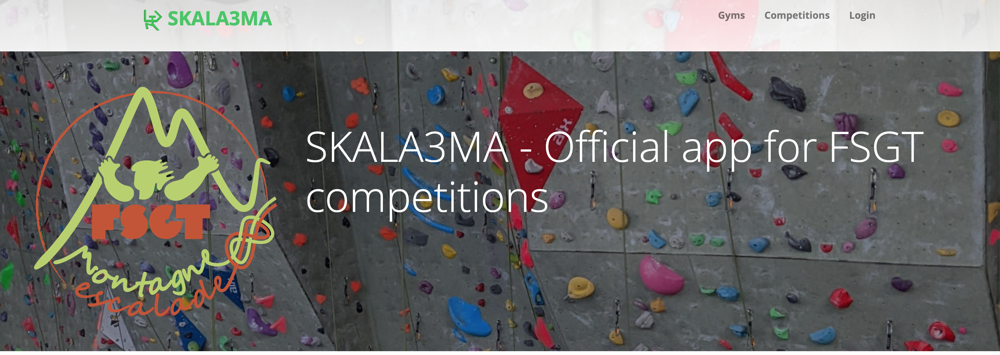
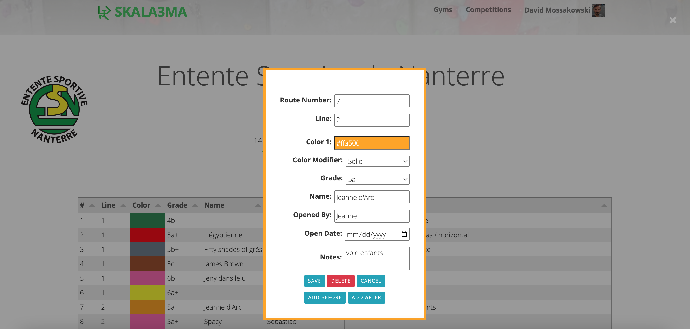

# SKALA3MA

Application to manage climbing gym routes, your daily climbing progress and competitions. 

https://skala3ma.com



## Features:
- Add and edit gym with logo, address, URL
- Add and edit multiple route sets
- Add and edit activities and mark each ascent as complete, flash or incomplete with a comment
- View graph of activities
- Create a competition with a poster
- Public competition registration link
- Easy route entry during competition
- Instant scoring and downloadable CSV results
- Multi-language
- Google and Facebook logins
- Printable route page for gyms


## Technologies used

- Python 3
- Flask
  - OAuth libraries for authentication
- Jinja2 templates
- Apexcharts https://apexcharts.com/
- Tabulator https://tabulator.info/




## Development environment setup

The following instructions are for local development. 

Minimum version of Python is 3.7. You will need to have either Google or Facebook developer account and add the app there to enable local authentication.

1. Create certificate and key files:
``` 
 openssl req -newkey rsa:2048 -new -nodes -x509 -days 3650 -keyout key.pem -out cert.pem
```

2. Create Python Virtual Environment
```
  python -m venv .venv
```

3. Enter Virtual Environment
```
  source .venv/bin/activate
  
  If on windows:
  source .venv/scripts/activate
```

4. Install the requirements
```
  pip install -r requirements.txt
```
4. Modify the .env file to set the correct values

```
  DATA_DIRECTORY=<path to the data directory>
  GOOGLE_CLIENT_ID=<your Google client id>
  GOOGLE_CLIENT_SECRET=<your Google client secret>
  FACEBOOK_CLIENT_ID=<facebook client id>
  FACEBOOK_CLIENT_SECRET=<facebook client secret>
  GODMODE=true
```
DATA_DIRECTORY can be relative but must exist. If omitted the system will create db and uploads directories in the current working directory.

See how to create your Google client ID and secret at [https://developers.google.com/identity/protocols/oauth2?hl=en](https://developers.google.com/identity/protocols/oauth2?hl=en)

To create your facebook client head to Meta console:
    https://developers.facebook.com/

You will need to create your development account and create a new app there. Add Facebook login product and add your URL to the redirect list of URLS: https://localhost:5000/facebook/auth

5. Run the server
```
  python server.py
```

You can also run the server using gunicorn:
```
  gunicorn --timeout 60 --limit-request-line 0 --limit-request-field_size 0 -b :5000 --keyfile=key.pem --certfile=cert.pem  -c app.py server:app
```

6. Using your favorite browser go to https://localhost:5000/

7. The first user that logs in will be given all permissions to create gyms, competitions, etc. This user is assumed to be a full admin. This functionality is independent of the GODMODE setting in .env file. Setting GODMODE=true in .env file will make every user a full admin. This is what happens on [skala3ma-develop.onrender.com](https://skala3ma-develop.onrender.com/) site where we do beta tests.

8. The application starts completely empty so to do any tests you will need to: 
  - create a gym 
  - create a competition 
  - sign up yourself for the competition
  - logout and sign up some anonymous users
  - manage the state of competition through admin console

  We will try to provide a test database that will have a good set of working data soon.


