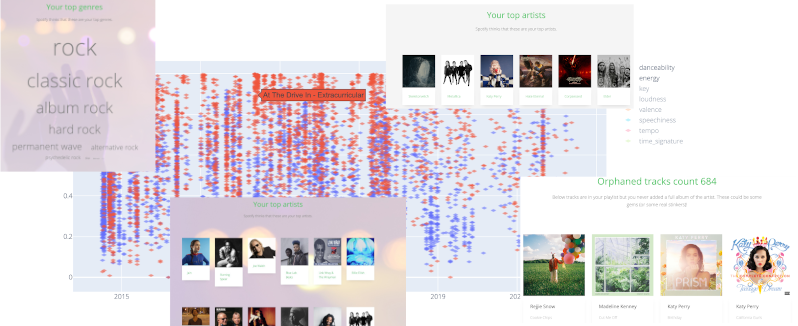

Additive Spotify Analyzer
=========================

Collection of various analysis on Spotify data. 

For suggesting an analysis or report a bug add an issue here on GitHub. 

Available on Render: https://spotify.onrender.com/

... and on Heroku (free account so takes a while to reactivate): https://additive-spotify-analyzer.herokuapp.com/

Data retrieved from Spotify:
- All tracks saved (liked)
- All albums saved
- All artists liked
- All playlists created 
- Top 50 tracks (long, medium and short term)
- Top 50 artists (long, medium and short term)

Analysis implemented:
- Audio features graph - plots normalized track features as a time series
- Orphaned tracks - shows tracks which were added without adding a whole album
- Top artists - shows top artists as a gallery
- Top genres - shows top genres in a word cloud 
- Tracks list - just a simple list of tracks

Technologies used
-----------------

- Python 3
- Flask
- OAuth libraries for authentication with Spotify
- Numpy
- Pandas
- matplotlib for generating a plot (not used right now) 
- Plotly for plotting features as a timeseries
- sklearn for clustering and preprocessing the data
- Jinja2 templates

